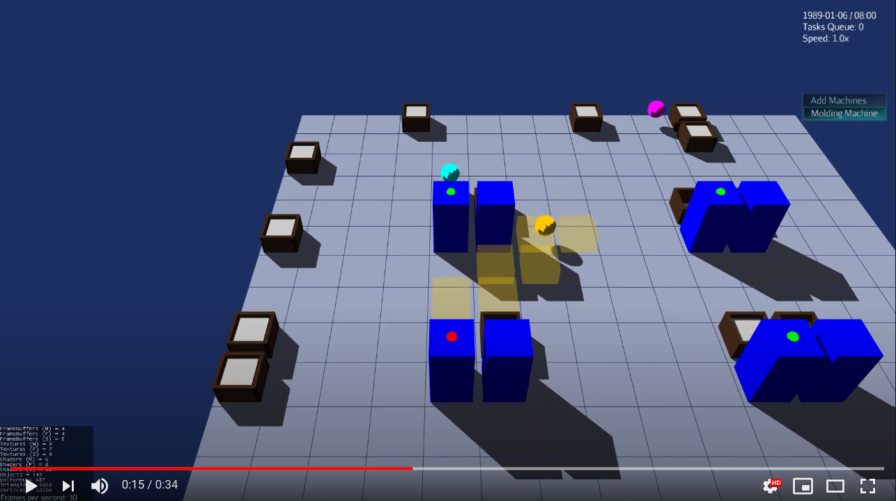

<a href="https://paypal.me/benckx/2">

</a>

# About

A basic camera system for 3D management/strategy games for <a href="https://jmonkeyengine.org">jMonkeyEngine</a>
/ <a href="https://www.lwjgl.org/">LWJGL</a>, that I developed while working on my game side
project *<a href="https://benckx.itch.io/elb">Everybody Loves Bricks</a>*.

*Ouistiti* is French for marmoset.



* https://benckx.itch.io/elb
* https://www.youtube.com/watch?v=Tm6QexsctfQ
* https://www.youtube.com/watch?v=qzs6Z_jM6mE

# Features

* Move camera by holding right click
* Move camera with WASD keys and/or arrow keys
* Zoom in and out with the mouse wheel
* Two view modes: Top view and "Isometric" view
* Switch view with **V** (or use **T** for Top View, **I** for Isometric View)
* Rotate with **B** (counter-clockwise) and **N** (clockwise) on "world axis" (i.e. from player's perspective, the world
  rotates)
* Rotate on "world axis" by holding right click + keep left Control pressed
* Rotate on camera axis (from player's perspective, camera rotates on its axis like a security camera) by holding right
  click + keep left Shift pressed

Default key mappings can be overridden.

The library is designed with the floor sitting in the XY plane, assuming it makes sense to program your game characters,
units, buildings, etc. on a XY tiled grid.

# Usage

## Import with Gradle

```groovy
repositories {
    maven { url "https://jitpack.io" }
}

dependencies {
    compile "com.github.benckx:ouistiti:2.0"
}
```

## Kotlin

```kotlin
import be.encelade.ouistiti.CameraManager
import com.jme3.app.SimpleApplication

//...

class DemoSimpleApp : SimpleApplication() {

    lateinit var cameraManager: CameraManager

    override fun simpleInitApp() {
        cameraManager = CameraManager(this)
        cameraManager.addDefaultKeyMappings()
    }

    override fun simpleUpdate(tpf: Float) {
        cameraManager.simpleUpdate(tpf)
    }

}
```

## Java

```Java
import be.encelade.ouistiti.CameraManager;
import com.jme3.app.SimpleApplication;

// ...

public static class DemoSimpleApp extends SimpleApplication {

    CameraManager cameraManager;

    @Override
    public void simpleInitApp() {
        cameraManager = new CameraManager(this, ISOMETRIC_VIEW, new DefaultCameraSpeedCalculator());
        cameraManager.addDefaultKeyMappings();
    }

    @Override
    public void simpleUpdate(float tpf) {
        cameraManager.simpleUpdate(tpf);
    }

}
```

# Examples

## In Kotlin

https://github.com/benckx/ouistiti/blob/master/src/test/kotlin/Demo.kt

## In Java

In a separate Java only sample project:<br/>
https://github.com/benckx/ouistiti-java-sample/blob/master/src/test/java/TestCameraManagerJava.java

# Configuration

## Camera Speed

Implement the following interface and pass it as parameter of `CameraManager` to customize the movement speed (excluding
the `tpf`).

```kotlin

import com.jme3.scene.CameraNode

interface CameraSpeedCalculator {

    fun cursorMovementSpeed(cameraNode: CameraNode): Float

    fun keysMovementSpeed(cameraNode: CameraNode): Float

    fun zoomSpeed(value: Float, cameraNode: CameraNode): Float

    fun cameraRotationSpeed(cameraNode: CameraNode): Float

}
```

# Change log

## Version 2.0

* Rotation:
    * Either on "world axis" (the world rotates)
    * Either on the camera axis
    * Before these changes, only 90° fixed rotations were enabled, therefore `SIDE_VIEW` has been removed (since it's
      now a specific case of the `ISOMETRIC_VIEW`). The 2 modes remaining are `TOP_VIEW` and `ISOMETRIC_VIEW`.
* Move with WASD keys
* Upgrade Kotlin from 1.4.20 to 1.5.21
* Upgrade JME from 3.3.2-stable to 3.4.0-stable

## Version 1.2

* Use `chimp-utils` project
* Update Kotlin from 1.4.10 to 1.4.20
* Add more customizations settings (split `CameraSpeedCalculator`, split the different default key mappings, etc.)

# Related Project

Collection Kotlin of APIs and Helper:

* https://github.com/benckx/chimp-utils

If I manage to extract re-usable management game features from my game, I would move them to the ouistiti project, while
more generic / engine-related components would be added here in the chimp-utils project.
